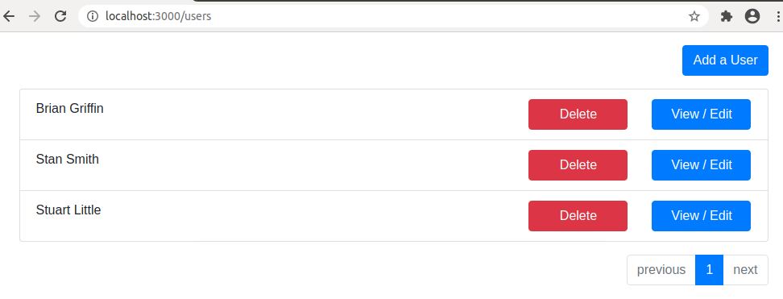

 ## Backend
 
* Express
* Typescript
* Node.js
* Jest - unit testing framework
* Docker
* MySQL

## Client
* React
* Typescript

# Prerequisite
The following is need
* Docker
* Node.js

### Getting Started

In the root of the project, run the following docker command.
The first command will build the dockers.  The second command invokes the Node.js application Docker and MySql docker.
```
> docker-compose build
> docker-compose up
> cd client
> npm start
```

Run database migrations
```
> backend/docker/npm.sh run db:prep
```

Start client
```
> cd client
> npm start
```

Open the application in you browser
* http://localhost:3000/users


